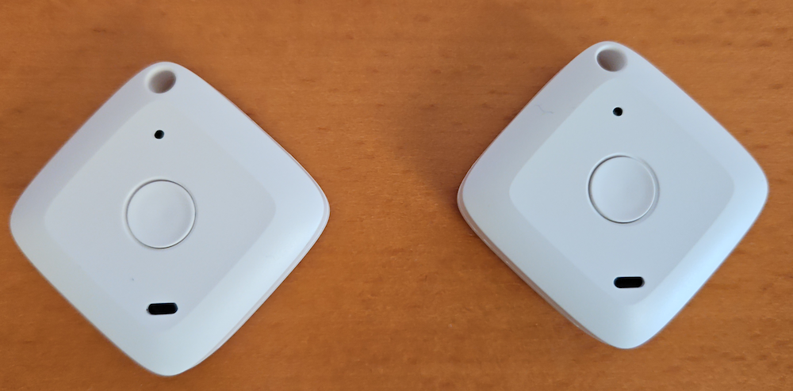
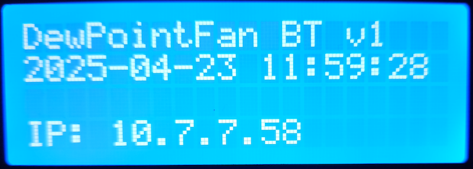
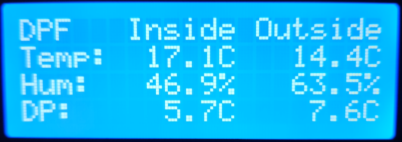
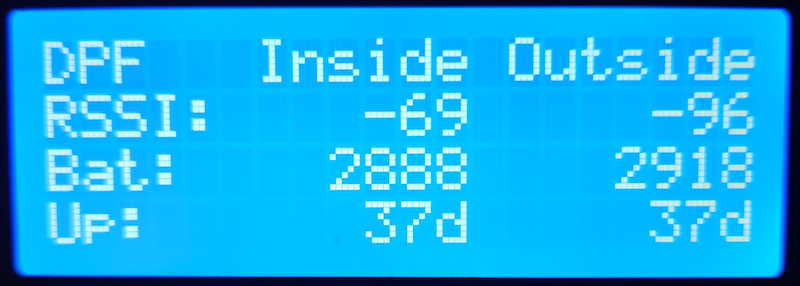
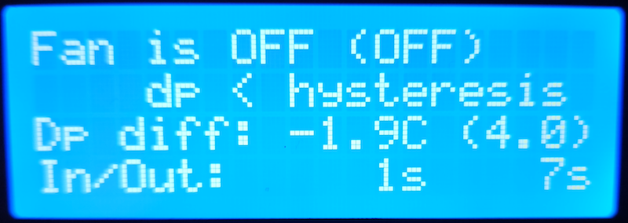

Dew Point Fan (Bluetooth version)
---------------------------------
This is version 2 of my dew point fan controller. Version 1 can be found [here](https://github.com/aluedtke7/dew-point-fan).

I'm using now two bluetooth sensors from Brifit which are available on Amazon. Since this controller
needs Bluetooth, I switched to a Raspberry Pi Zero 2W.

Besides the two Bluetooth sensors, a 4x20 LCD with I2C interface, a solid state relay, three resistors
and an on-off-on switch is needed. The switch is used to override the fan state. Normally, the switch is
in the middle (off) position and the fan controller determines the fan state. The switch can force the 
fan state to either off (when the controller sets it to on), and it can force the state to on when the
controller sets it to off.

The temperature, humidity and dew point values are summed up to calculate the average values that can be sent
every minute to an InfluxDB server.

A little HTTP server is included, and the values could be seen via a browser ([http://<ip_of_fan_controller>:8080]()).
In addition, a REST API is also available which is used by the [Flutter App](https://github.com/aluedtke7/dew-point-fan-app).
With this app, the override of the fan state can be changed too (but the hardware switch must be set to *auto*).

The app is started as a Systemd service. [See below for details](#install-app-as-a-service).

All configuration is done via the `config.json` file that should be located beside the binary. Please enter the
necessary values according to your needs.

The program uses build constraints to enable the execution on the Raspberry Pi and on the
development machine. Therefore, two interfaces (`Display` and `Gpio`) have been created and there
are two implementations of these interfaces.

## Schematic
Fritzing schematic:
<p float="left">
    
</p>

Brifit sensors:
<p float="left">
    
</p>

Display examples:
<p float="left">
    
    
</p>
<p float="left">
    
    
</p>

## Raspberry PI Setup
### Configure I2C
I2C must be enabled on the raspberry pi since the display needs this:

- Start `sudo raspi-config`
- Select `Interface Options`
- Select `I2C` and enable the I2C interface

Test if LCD is visible on the I2C bus:

    sudo apt update && sudo apt install i2c-tools
    sudo i2cdetect -y 1

The output should typically show a device on address 27.
````
> sudo i2cdetect -y 1
     0  1  2  3  4  5  6  7  8  9  a  b  c  d  e  f
00:                         -- -- -- -- -- -- -- --
10: -- -- -- -- -- -- -- -- -- -- -- -- -- -- -- --
20: -- -- -- -- -- -- -- 27 -- -- -- -- -- -- -- --
30: -- -- -- -- -- -- -- -- -- -- -- -- -- -- -- --
40: -- -- -- -- -- -- -- -- -- -- -- -- -- -- -- --
50: -- -- -- -- -- -- -- -- -- -- -- -- -- -- -- --
60: -- -- -- -- -- -- -- -- -- -- -- -- -- -- -- --
70: -- -- -- -- -- -- -- --
````

### Install app as a service

I used a sub folder `dpf-bt` in the home folder of user `pi` for all the files. You have
to create it manually (`mkdir ~/dpf-bt`). Then copy these files:

- `config-sample.json`
- `dpf-bt.service`
- `start-dpf-bt.sh`

to the Raspberry Pi:

    scp ./config-sample.json pi@192.168.0.100/home/pi/dpf-bt/config.json
    scp ./dpf-bt.service pi@192.168.0.100/home/pi/dpf-bt
    scp ./start-dpf-bt.sh pi@192.168.0.100/home/pi/dpf-bt

Change the content of `config.json` as needed. Copy the file `dpf-bt.service` to `/etc/systemd/system/`.

    nano config.json
    sudo cp dpf-bt.service /etc/systemd/system/

Enable the service for automatic start:

    sudo systemctl enable dpf-bt

Start the service manually to check if everything works as expected:

    sudo systemctl start dpf-bt

Check if service could be started:

    systemctl status dpf-bt

### Show service log

    journalctl -f -u dpf-bt.service

## Cross compilation
`buildTime` is a variable in `dpf-main.go` which holds the build timestamp.

    # build binary for Arm on Linux with timestamp
    GOOS=linux GOARCH=arm GOARM=7 go build -o dpf-bt -ldflags "-X 'main.buildTime=$(date '+%Y-%m-%d %H:%M:%S')'"

    # copy binary to Raspberry Pi - change the name of the raspberry and domain as needed
    scp dpf-bt pi@dpf-bt.fritz.box:/home/pi/dpf-bt

    # or use ip address
    scp dpf-bt pi@192.168.0.100:/home/pi/dpf-bt

