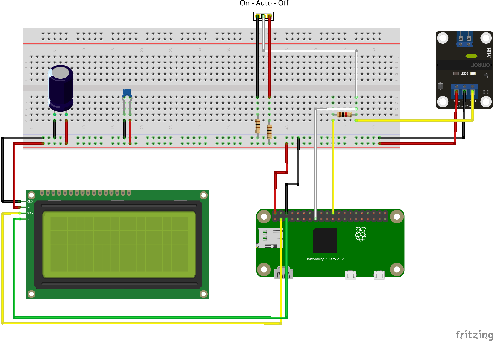

Dew Point Fan - Bluetooth version
---------------------------------
# Todo's
- ~~Fake Implementierung von display.Display (wg. Test auf macOS)~~
- ~~Auswertung der Taupunkte inkl. Reason~~
- ~~GPIO Pins für Input/Output verarbeiten, inkl. Fake Variante für Desktop OS~~
- ~~Anbindung InfluxDB (neuen Bereich einrichten)~~
- ~~Mittelwertbildung und Senden an InfluxDB 1-mal pro Minute~~
- ~~Web-Server implementieren~~

## Setup Raspberry PI
I2C must be enabled on the raspberry:

- Start `sudo raspi-config`
- Select `Interface Options`
- Select `I2C` and enable the I2C interface

Test if LCD is visible on the I2C bus:

    sudo apt update && sudo apt install i2c-tools
    sudo i2cdetect -y 1

The output should typically show a device on address 27.

## Cross compilation

    GOOS=linux GOARCH=arm GOARM=7 go build -o dpf-bt
    scp dpf-bt pi@dpf-bt.fritz.box:/home/pi

## Screenshots and photos
Fritzing schematic:

    

